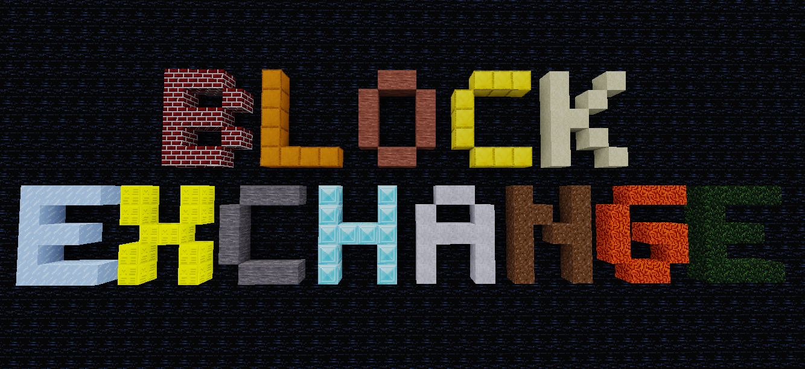

minetest blockexchange mod


[](https://coveralls.io/github/blockexchange/blockexchange?branch=main)
[](license.txt)
[](https://content.minetest.net/packages/BuckarooBanzay/blockexchange)

# Overview

The `blockexchange` mod allows you to share and use your builds across different worlds.
It uses a central (configurable) server to exchange schemas (builds) of near infinite size.

The server part lives at https://github.com/blockexchange/blockexchange_server and can be self-hosted.

Schemas can be browsed and administered on the central server: https://blockexchange.minetest.ch



# Basic usage

## Download

* Start your minetest app
* Download the `blockexchange` mod in the "Content" tab from the ContentDB.
* Add the `blockexchange` mod to the secure HTTP-Mods settings (search for "http" in the "settings" tab)
* Create a new world and activate the mod
* Grant yourself the needed privs with `/grantme blockexchange`
* Search for an empty place and mark it with `/bx_pos1`
* Browse online for a schema at https://blockexchange.minetest.ch
* Load the schema with the `/bx_load <username> <schemaname>` command (**WARNING**: this may place the schema over existing builds!)
* Have fun!

## Upload

* Start your minetest app
* Download the `blockexchange` mod in the "Content" tab from the ContentDB.
* Add the `blockexchange` mod to the secure HTTP-Mods settings (search for "http" in the "settings" tab)
* Create a new world and activate the mod
* Grant yourself the needed privs with `/grantme blockexchange`
* Build a thing
* Set positions on the opposite corners with `/bx_pos1` and `/bx_pos2`
* Login with an access token generated from https://blockexchange.minetest.ch: `/bx_login [username] [access_token]`
* Save the schematic with `/bx_save <name>`

# Chat commands

## Offline

Local commands, they don't need the http-api and make no calls "home"

* **/bx_hud [on|off]** enables or disables the blockexchange hud
* **/bx_pos1 [pos?]** mark position 1 (uses WE positions if available)
* **/bx_pos2 [pos?]** mark position 2 (uses WE positions if available)
* **/bx_cleanup** cleans up stray metadata and invalid param2 values
* **/bx_area_remove [area_id?]** removes the area information (not the build)
* **/bx_area_mark [area_id?]** marks the area
* **/bx_emerge** emerge the selected area
* **/bx_save_local [schematic-name]** saves a local schematic to `<worldmods>/bxschems`
* **/bx_load_local [schematic-name]** loads a local schematic from `<worldmods>/bxschems`
* **/bx_allocate_local [schematic-name]** allocates a local schema

## Online

Online commands, they call the remote-server with the http api

### Read-only

* **/bx** shows the info and settings menu
* **/bx_info** shows infos about the connected blockexchange server
* **/bx_license** sets or displays the license of your uploaded schematics (defaults to CC0)
* **/bx_load [username] [schematic-name]** load a schematic by name onto pos1
* **/bx_placer [username] [schematic-name]** creates a placement tool for the schematic
* **/bx_load_update [area_id?]** loads the changes of a loaded area
* **/bx_allocate [username] [schematic-name]** allocates a schematic by name
* **/bx_login [username] [access_token]** logs in with the username and token
* **/bx_cancel** Cancels an active job

### Write (needs a login)

* **/bx_save [schematic-name]** saves/uploads the selected area as a new schematic
* **/bx_save_update [area_id?]** saves the changes of a loaded area (use it with the position markers or it will upload the whole schematic)
* **/bx_autosave [area_id?]** toggles the autosave flag for the area
* **/bx_logout** logs out
* **/bx_login** shows the login status

# Privileges

* **blockexchange** can use the blockexchange commands (admin)
* **blockexchange_protected_upload** can upload self-protected areas (survival-compatible)

# Settings

* **blockexchange.url** URL to the central server

The mod also needs the http api:
```
secure.http_mods = blockexchange
```

# Api docs

See: https://blockexchange.github.io/blockexchange/

# License

* Code: MIT

* Textures
    * `textures/blockexchange_button*png` CC0 https://opengameart.org/content/ui-pack
    * `textures/blockexchange_check*png` CC0 https://opengameart.org/content/ui-pack
    * Everything else: CC-BY-SA 3.0 (http://www.small-icons.com/packs/16x16-free-application-icons.htm)
